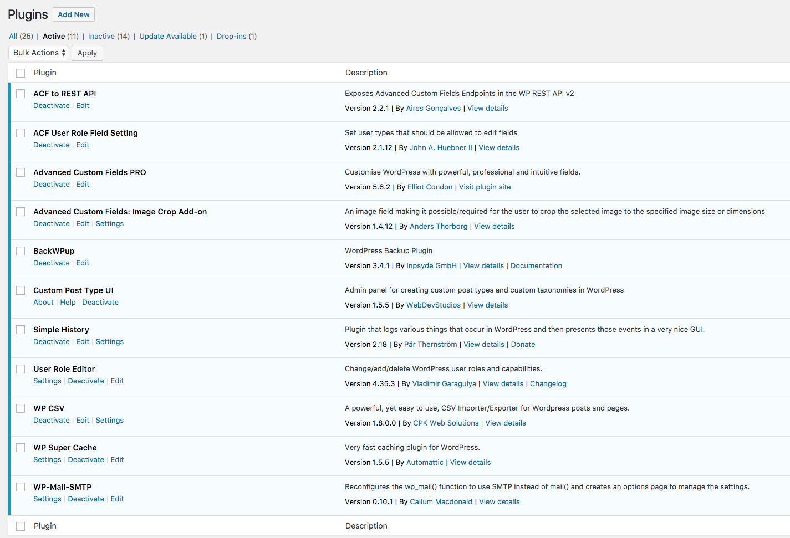

ICN Kaleidoscope Wordpress theme
================================


Description
-----------

This wordpress theme can be used to display project information and filter them according to specific filter categories, such as locations, portfolio areas, industries etc.


Download and Installation
-------------------------

In this section, you will find basic installation instructions. Please see our detailed [Installation Guide](installation/Installation%20Guide%20Kaleidoscope.docx) and the necessary additional files in the same [directory](installation/) for the installation procedure.

### Prerequisites

The next steps are based on the assumption that there is a Linux server or virtual machine in place running a Ubuntu (or Debian) installation and being able to login to the machine via SSH (or direct console) with a user having SUDO permissions. 

The following packages need to be installed:
* PHP (>=5.6)
* Apache 2
* MySQL
* npm
* nodejs
* webpack


You can use the following command line commands to install those applications and libraries:

```
# sudo add-apt-repository -y ppa:ondrej/php
# sudo apt-get update
# sudo apt-get -y upgrade
# sudo apt-get -y install apache2 libapache2-mod-php5.6 php5.6-gd php5.6-imagick php5.6-curl php5.6-mysql mysql-server git npm nodejs-legacy
# npm install --global webpack
```

You would also need to configure Apache modules as follows:

```
# sudo a2dismod mpm_event
# sudo a2enmod rewrite php5.6
```


Most probably it is also a good idea to enable mod_ssl and configure it with the appropriate certificates that are validate within your organization's network.

Set memory limit, post limit, and max upload size to a value that supports the upload of large files to wordpress.
```
sudo sed -i.orig 's/upload_max_filesize\ \=\ 2M/upload_max_filesize\ \=\ 512M/g' /etc/php/5.6/apache2/php.ini
sudo sed -i.orig 's/post_max_size\ \=\ 8M/post_max_size\ \=\ 512M/g' /etc/php/5.6/apache2/php.ini
sudo sed -i.orig 's/memory_limit\ \=\ 128M/memory_limit\ \=\ 768M/g' /etc/php/5.6/apache2/php.ini
```

### Wordpress installation

Download wordpress installation files from e.g. https://wordpress.org/latest.tar.gz. Untargz this under /var/www/html. If Apache/PHP/MySQL is running as expected, you will now be able to install wordpress using their web-interface. It will guide you through the process. 

### Wordpress configuration 

Once wordpress is installed, access the backend http://hostname/wp-admin and go to the plugins page. Make sure the plugins listed below are installed. You will need a license for Advanced Custom Fields Pro.



When ACF pro is installed, use file ["acf-export-xxxx-xx-xx.json"](installation/acf-export-2017-09-15.json) to upload and import the field descriptions.


### Installation of Kaleidoscope theme

Get Sources from github.com/SAP/wordpress-kaleidoscope and check them out into /var/www/html/wp-content/themes/kaleidoscope (or your wordpress directory that you choose).  Run webpack in this directory.

```
cd /var/www/html/wp-content/themes
git clone https://github.com/SAP/wordpress-kaleidoscope.git kaleidoscope
cd kaleidoscope
webpack
```


Depending on your host system, some additional steps may be necessary. When everything is set up correctly, you will see Kaleidoscope serving the projects you defined in wordpress under http(s)://hostname/.

Support
-------

If you need any support, have any question or have found a bug, please report it in the [GitHub bug tracking system](https://github.com/SAP/wordpress-kaleidoscope/issues). 

License
-------
see [License](LICENSE) file
