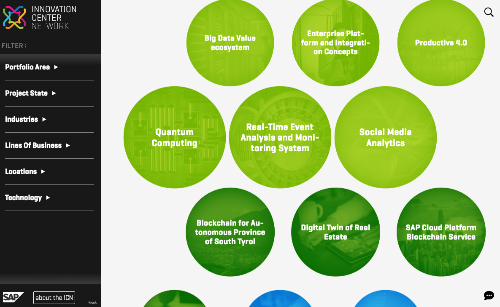

ICN Kaleidoscope Wordpress theme
================================

Description
-----------

This wordpress theme can be used to display project information and filter them according to specific filter categories, such as locations, portfolio areas, industries etc.

Requirements
------------

You will need a wordpress instance with an Advanced Custom Fields Pro plugin.

Download and Installation
-------------------------

Please see our [Installation Guide](installation/Installation%20Guide%20Kaleidoscope.docx) and the necessary additional files in the same [directory](installation/) for the installation procedure.

Support
-------

If you need any support, have any question or have found a bug, please report it in the [GitHub bug tracking system](https://github.com/SAP/wordpress-kaleidoscope/issues). 

License
-------
see [License](LICENSE) file
